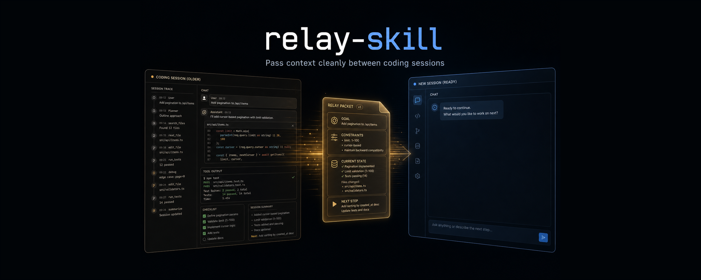

# Relay Skill

<p align="center">
  
</p>

English | [CN](README.zh-CN.md)

Relay is a lightweight pass/pickup handoff skill for coding agents.

It helps you end a crowded session cleanly, start a fresh one, and continue the same work without manually rewriting all the context.

Relay keeps Matt Pocock's original `handoff` spirit, but strengthens the two places that matter most in real use:

- the default handoff document is more structured and harder to misread
- pickup is more careful about choosing the right relay file

## Quick Start

Use the smart command when you do not want to think about the mode:

```text
/relay
```

Use explicit commands when you do:

```text
/relay-pass
/relay-pickup
```

The workflow is simple:

```text
full session
  -> /relay or /relay-pass
  -> Relay writes a handoff document
  -> new session
  -> /relay or /relay-pickup
  -> agent reads the handoff and continues
```

Built-in defaults:

- New Relay files are written to `.relay/` in the current project.
- Relay writes compact handoff documents by default, but the compact mode is still structured and high-signal.
- `--full` is the maximum-fidelity mode. It should spend tokens freely to preserve context, decisions, and failed paths.
- Smart `/relay` remains available, but on a fresh ambiguous session Relay should prefer one short clarification question over silently loading a random old handoff.
- `.relay/` is ignored by this repository's `.gitignore` pattern and should be treated as local working state unless you intentionally version it.

## Why

Modern coding-agent workflows are no longer just a single chat box. Many developers maintain personal harnesses in places like `.claude/`, `.opencode/`, or global skill directories. Projects often also carry `CLAUDE.md`, `AGENTS.md`, rules, playbooks, and other files that are automatically injected into every session so the agent starts with the right operating context.

That works well at the beginning of a session. The problem appears later: after many turns, long tool traces, dead-end investigations, partial plans, and subtle decisions, you still want to continue from the current state. The usual instinct is to compact the current session and keep going. Depending on the runtime, that may compress or blur some automatically injected context, make the session harder to audit, lose important details, and eventually reduce output quality.

The alternative is to start a new session and manually write a careful prompt explaining the current state. That is often better engineering hygiene, but it is mentally expensive. You need to remember what changed, what failed, what matters, and what the next agent should do first.

Relay exists for that gap: pass the baton from one session to the next.

Matt Pocock's excellent [`handoff`](https://skills.sh/mattpocock/skills/handoff) skill showed how powerful a tiny handoff document can be. Relay keeps that lightweight spirit, but adds the missing second half of the workflow and strengthens the default baton pass:

- `pass`: write a relay document for the next agent.
- `pickup`: find, read, validate, and continue from a relay document.
- Smart `/relay`: infer whether the user is passing or picking up, but avoid silent mis-pickups in ambiguous fresh sessions.
- Project defaults: configure where Relay writes files and how detailed they should be.

Use Relay when you work across multiple coding-agent windows, hit context limits, pause a task, switch models, or want a fresh session without manually reconstructing everything.

## What Relay Strengthens

Relay is not trying to replace Matt's idea with a bigger system. It keeps the same core shape and strengthens the failure points that show up in real use.

### Stronger default pass

The default handoff is still compact, but it should preserve the pieces that most often get lost:

- the actual goal
- hard constraints that must not be violated
- current state
- failed approaches that should not be repeated
- settled decisions that should not be casually reopened
- the next best starting step

### Stronger default pickup

Pickup should not just grab the newest file and hope for the best. It should prefer the best candidate using:

- explicit file path, if given
- filename or slug match
- user hint or focus match
- branch or working-directory match, when visible
- recency

Pickup should also announce which relay it used and warn briefly if it looks stale or mismatched.

### Stronger `--full`

`--full` is not just "slightly longer". It is the maximum-fidelity mode:

- preserve more original user wording
- preserve more decision rationale
- capture dead ends and why they failed
- keep more file and workspace context
- write a stronger restart prompt for the next agent

## Usage

### 1. Pass The Baton

At the end of a busy session, run:

```text
/relay-pass
```

or let Relay infer that you are passing:

```text
/relay
```

Relay writes a handoff document named like this:

```text
.relay/relay-20260512T091530Z-exp3-reward-logging-a1b2c3.md
```

You can add a focus for the next session:

```text
/relay-pass next session should continue experiment 3 and debug reward logging
```

### 2. What The Default Relay Document Looks Like

Relay now prefers YAML frontmatter plus a structured Markdown body:

```markdown
---
schema_version: 1
created: 2026-06-03T09:15:30Z
mode: compact
storage: project
working_directory: /repo
focus: experiment 3 reward logging
branch: main
commit: a1b2c3d
---

# Relay: experiment 3 reward logging

## Goal

Continue experiment 3 and fix reward logging without reopening the storage design.

## Hard Constraints

- Do not change the experiment naming scheme.
- Keep the current log format backward-compatible.

## Current State

Reward logging was traced to the wrapper layer. Two files were already edited and tests were not rerun yet.

## Failed Approaches

- Rewriting the entire logging adapter was too broad for the bug and introduced unrelated churn.

## Explicit Next Step

Inspect the wrapper call site, patch the missing reward field, then rerun the targeted tests.

## References

- `src/wrapper.py`: likely source of the missing reward field.
- `tests/test_reward_logging.py`: targeted regression coverage.
```

Use exact heading names when the section exists. The structure matters because fresh agents often lose the thread around constraints, failed paths, and already-made decisions.

### 3. Compact Template You Can Copy

Use this when you want a structured, high-signal relay without paying the `--full` cost:

```markdown
---
schema_version: 1
created: 2026-06-03T09:15:30Z
mode: compact
storage: project
working_directory: /path/to/project
focus: <next-session focus>
branch: <branch-if-known>
commit: <commit-if-known>
---

# Relay: <short title>

## Goal

<What the next session is trying to achieve.>

## Hard Constraints

- <Constraint that must not be violated>
- <Another hard boundary>

## Current State

<Known current state only. No guesses.>

## Failed Approaches

- <What was tried and why the next session should not repeat it>

## Settled Decisions

- <Decision already made and not meant to be casually reopened>

## Explicit Next Step

<Best first action for the next agent>

## References

- `<path-or-url>`: <why it matters>
```

### 4. Full Template You Can Copy

Use this as the reference shape for `--full` when you want the most faithful possible baton pass:

```markdown
---
schema_version: 1
created: 2026-06-03T09:15:30Z
mode: full
storage: project
working_directory: /path/to/project
focus: <next-session focus>
branch: <branch-if-known>
commit: <commit-if-known>
---

# Relay: <short title>

## Goal

<What the work is trying to achieve, written for a zero-context agent.>

## Hard Constraints

- <Exact wording or close paraphrase of the constraints that must survive>
- <Performance, compatibility, or scope boundaries>

## Current State

<Where things stand now, including useful validation status or workspace facts when known.>

## Failed Approaches

- <Approach that failed>
  Why it failed: <brief reason>

Prefer real product, design, implementation, or investigation dead ends here. Do not fill this section with low-value process hiccups unless they materially affect the next session.

## Settled Decisions

- <Decision already made>
  Why it was made: <brief rationale>

## Verbatim Doctrine

- "<Important original user wording that the next session should inherit almost exactly>"

## Explicit Next Step

<The single best first step for the next session, or say that the task is complete and no next step is required>

## Known Blockers

- <Only include real blockers>

## Open Questions

- <Only include unresolved questions that truly matter>

## Files Changed

- `<path>`: <what changed>

## Files Consulted

- `<path>`: <why it mattered>

## Suggested Skills

- `<skill>`: <why the next session should use it>

## References

- `<path-or-url>`: <why it matters>

## Resume Prompt

Continue from this relay. Start by <first action>. Preserve the hard constraints above, do not repeat the failed approaches, and use the referenced files before widening scope.
```

### 5. Start A Fresh Session

Open a new coding-agent session in the same project and run:

```text
/relay-pickup
```

or:

```text
/relay
```

Relay should:

1. look in `.relay/` first
2. use your hint if you provided one
3. prefer the strongest candidate instead of blindly taking the newest file
4. state which file it used
5. warn if the relay looks stale or mismatched
6. continue the task

If you know what you want to resume, add a hint:

```text
/relay-pickup experiment 3 reward logging
```

If you already know the exact file, pass the path:

```text
/relay-pickup .relay/relay-20260512T091530Z-exp3-reward-logging-a1b2c3.md
```

Smart `/relay` still exists, but Relay should not silently auto-pick a random old handoff on a fresh ambiguous session. If the signal is weak, a short clarification question is better than a confident wrong pickup.

### 6. Maximum-Fidelity Passes With `--full`

Write a fuller handoff when wording, decisions, tradeoffs, or dead ends matter:

```text
/relay-pass --full preserve the important original wording and decisions
```

In `--full`, Relay should optimize for baton-passing quality, not token savings. A full relay should usually preserve more detail in:

- `Hard Constraints`
- `Current State`
- `Failed Approaches`
- `Settled Decisions`
- `Verbatim Doctrine`
- `Files Changed`
- `Files Consulted`
- `References`
- `Resume Prompt`

Even in `--full`, Relay should still avoid copying large artifacts blindly. Reference files, plans, issues, or diffs by path or URL unless the exact text itself is the thing that must be preserved.

The biggest difference in `--full` should not just be more lines. It should preserve more of the user's doctrine in their own words, make the next first action unambiguous, and record the most valuable dead ends that must not be repeated.

Force a compact handoff even if your project default is full:

```text
/relay-pass --compact preserve only what the next session needs
```

Force project-local storage for one pass:

```text
/relay-pass --keep next session should continue experiment 3
```

Use a one-shot temp file, matching Matt-style temp storage:

```text
/relay-pass --tmp next session should continue experiment 3
```

Supported one-shot flags:

- `--keep` / `--persist`: write this handoff under `.relay/`.
- `--tmp` / `--temp`: write this handoff under `${TMPDIR:-/tmp}`.
- `--full`: write a maximum-fidelity handoff.
- `--compact` / `--brief`: write a compact handoff.

### 7. Set Project Defaults

Use `/relay-set` when you want future Relay runs in this project to default to a different behavior.

```text
/relay-set full temp
/relay-set compact project
/relay-set tmp
/relay-set full
```

The syntax is intentionally direct: words become defaults.

- `project`, `.relay`, `keep`, `persist`: default to `.relay/` storage.
- `tmp`, `temp`, `/tmp`, `temporary`: default to temp storage.
- `compact`, `brief`, `short`, `concise`: default to compact handoffs.
- `full`, `detailed`, `detail`: default to full handoffs.

Settings are stored in:

```text
.relay/config.json
```

Built-in defaults when no config exists:

```json
{"storage":"project","detail":"compact"}
```

Common `relay-set` choices:

- `/relay-set compact project`: best everyday default for most users.
- `/relay-set full project`: best when you want all normal relay files to optimize for fidelity.
- `/relay-set compact temp`: closest to Matt-style disposable handoffs.
- `/relay-set full temp`: detailed one-shot relay files.

## Pickup Discovery

Relay looks for handoff candidates in two places:

- `.relay/` in the current project.
- The top level of `${TMPDIR:-/tmp}` for Matt-style temp compatibility.

Candidate names:

- `relay-*.md`: Relay's own files.
- `handoff-*.md`: Matt-compatible pickup files.

Relay must not recursively scan shared temp directories. Temp discovery should be shallow, for example:

```bash
find "${TMPDIR:-/tmp}" -maxdepth 1 -type f \( -name 'relay-*.md' -o -name 'handoff-*.md' \) -print 2>/dev/null
```

```bash
find .relay -maxdepth 1 -type f \( -name 'relay-*.md' -o -name 'handoff-*.md' \) -print 2>/dev/null
```

This avoids the common `/tmp/pymp-*` or `/tmp/tmp*wandb*` permission errors caused by recursive `rg` or recursive `find` over `/tmp`.

Relay should prefer `created` timestamps and filename timestamps over raw mtime guesses when good metadata is available.

## Install

Relay currently ships as plain skill and command files. Until a registry installer is published, the recommended installation model is:

1. Clone the repository once into a stable local location.
2. Symlink the root `skills/` and `commands/` entries into your agent's config directory.
3. Restart the agent.

Clone once:

```bash
mkdir -p ~/.local/share
git clone https://github.com/RiAnBee/relay-skill.git ~/.local/share/relay-skill
```

If you already cloned it somewhere else, replace `~/.local/share/relay-skill` below with that path.

### Claude Code

Claude Code supports different install surfaces across versions and plugin modes. If your Claude Code setup supports plugin installation from this repository, prefer that. Otherwise use a manual install.

Manual symlink install:

```bash
mkdir -p ~/.claude/skills ~/.claude/commands
ln -s ~/.local/share/relay-skill/skills/relay ~/.claude/skills/relay
ln -s ~/.local/share/relay-skill/skills/relay-pass ~/.claude/skills/relay-pass
ln -s ~/.local/share/relay-skill/skills/relay-pickup ~/.claude/skills/relay-pickup
ln -s ~/.local/share/relay-skill/skills/relay-set ~/.claude/skills/relay-set
ln -s ~/.local/share/relay-skill/commands/relay.md ~/.claude/commands/relay.md
ln -s ~/.local/share/relay-skill/commands/relay-pass.md ~/.claude/commands/relay-pass.md
ln -s ~/.local/share/relay-skill/commands/relay-pickup.md ~/.claude/commands/relay-pickup.md
ln -s ~/.local/share/relay-skill/commands/relay-set.md ~/.claude/commands/relay-set.md
```

Fallback copy install:

```bash
mkdir -p ~/.claude/skills ~/.claude/commands
cp -R ~/.local/share/relay-skill/skills/relay* ~/.claude/skills/
cp ~/.local/share/relay-skill/commands/relay*.md ~/.claude/commands/
```

### Codex

Codex support uses native skills first. Relay intentionally does not ship Codex-specific prompt wrappers because the root `skills/` directory is the canonical behavior source.

```bash
mkdir -p ~/.codex/skills
ln -s ~/.local/share/relay-skill/skills/relay ~/.codex/skills/relay
ln -s ~/.local/share/relay-skill/skills/relay-pass ~/.codex/skills/relay-pass
ln -s ~/.local/share/relay-skill/skills/relay-pickup ~/.codex/skills/relay-pickup
ln -s ~/.local/share/relay-skill/skills/relay-set ~/.codex/skills/relay-set
```

Trigger from the skill UI or natural language, for example:

```text
Use the relay-pass skill
Use the relay-pickup skill
Use the relay-set skill with full temp
```

### OpenCode

OpenCode treats skills and slash commands as separate configuration surfaces. Install both for the best experience.

Never delete, overwrite, or replace an existing project `.opencode` directory to install Relay. Treat `.opencode` as user/project-owned configuration.

```bash
mkdir -p ~/.config/opencode/commands ~/.config/opencode/skills
ln -s ~/.local/share/relay-skill/commands/relay.md ~/.config/opencode/commands/relay.md
ln -s ~/.local/share/relay-skill/commands/relay-pass.md ~/.config/opencode/commands/relay-pass.md
ln -s ~/.local/share/relay-skill/commands/relay-pickup.md ~/.config/opencode/commands/relay-pickup.md
ln -s ~/.local/share/relay-skill/commands/relay-set.md ~/.config/opencode/commands/relay-set.md
ln -s ~/.local/share/relay-skill/skills/relay ~/.config/opencode/skills/relay
ln -s ~/.local/share/relay-skill/skills/relay-pass ~/.config/opencode/skills/relay-pass
ln -s ~/.local/share/relay-skill/skills/relay-pickup ~/.config/opencode/skills/relay-pickup
ln -s ~/.local/share/relay-skill/skills/relay-set ~/.config/opencode/skills/relay-set
```

Some OpenCode versions and UIs differ in whether project-local or GUI custom commands are loaded. Relay's documented OpenCode install path is global config to avoid modifying project-owned `.opencode` directories.

## If `/relay` Does Not Appear

If installation succeeds but `/relay` is not listed:

1. Confirm you installed root `skills/` and, where supported, root `commands/` for your actual runtime.
2. Restart the runtime so skills and commands are reloaded.
3. Check whether the runtime exposes plugin skills as namespaced commands.
4. For Codex, trigger by skill UI or natural language if slash commands are not available.
5. For OpenCode, prefer global `~/.config/opencode/` install paths over project-local `.opencode` changes.

The command wrappers are intentionally thin. They exist so Relay has stable user-facing entrypoints where each runtime supports them, while `skills/relay/SKILL.md` remains the single canonical behavior definition.

## Package Layout

Relay uses one canonical skill set plus thin command entrypoints:

```text
relay-skill/
├── .claude-plugin/plugin.json
├── commands/
│   ├── relay.md
│   ├── relay-pass.md
│   ├── relay-pickup.md
│   └── relay-set.md
├── skills/
│   ├── relay/SKILL.md
│   ├── relay-pass/SKILL.md
│   ├── relay-pickup/SKILL.md
│   └── relay-set/SKILL.md
└── adapters/
    ├── codex/README.md
    └── opencode/README.md
```

The adapters intentionally do not duplicate skills or commands. Install the same root `skills/` everywhere, and install root `commands/` only where the runtime supports slash-command files.

## Validation Fixtures

This repository includes lightweight fixtures and a contract check script for the documented relay format.

Run:

```bash
python tests/check_relay_contracts.py
```

The script validates:

- the strengthened `skills/relay/SKILL.md` contract
- the README template sections
- compact, full, and legacy pickup fixture files

## Relay Files And Privacy

Relay documents can contain sensitive project context, private file paths, internal decisions, and user wording. This applies to files under `.relay/` and temporary files under `${TMPDIR:-/tmp}`.

Treat `.relay/` as the preferred storage. Temp files are compatibility-oriented and usually less private.

Relay should avoid copying obvious secrets, tokens, private keys, passwords, or customer data into handoff documents. If exact wording matters but contains a secret value, redact the value and say that you redacted it.

This repo's `.gitignore` ignores `.relay/` by default so generated relay documents are not accidentally committed. If you intentionally want to version relay documents, remove `.relay/` from `.gitignore` after reviewing the content.

Do not commit secrets, credentials, private tokens, customer data, or sensitive internal information in relay documents.

## Attribution

Relay is inspired by and partially preserves core wording from Matt Pocock's `handoff` skill in [`mattpocock/skills`](https://github.com/mattpocock/skills), licensed under MIT.

See `NOTICE.md` for attribution details.

## License

MIT. See `LICENSE`.
